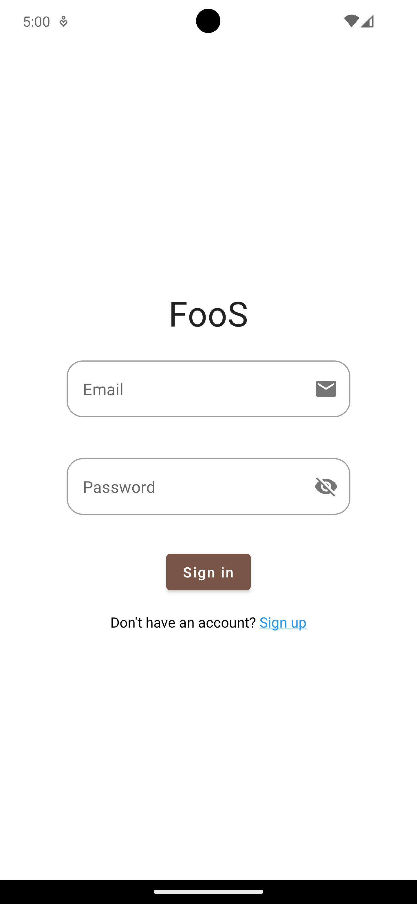
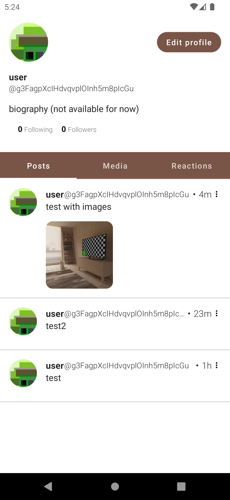
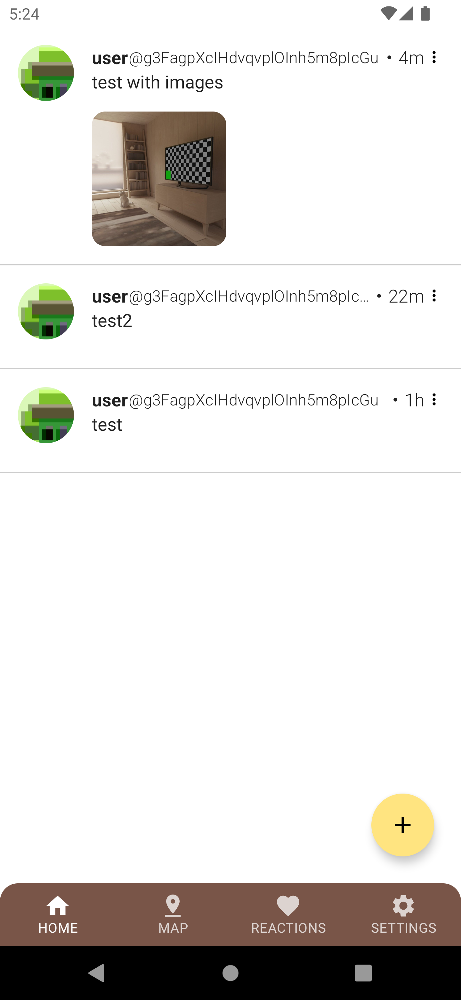
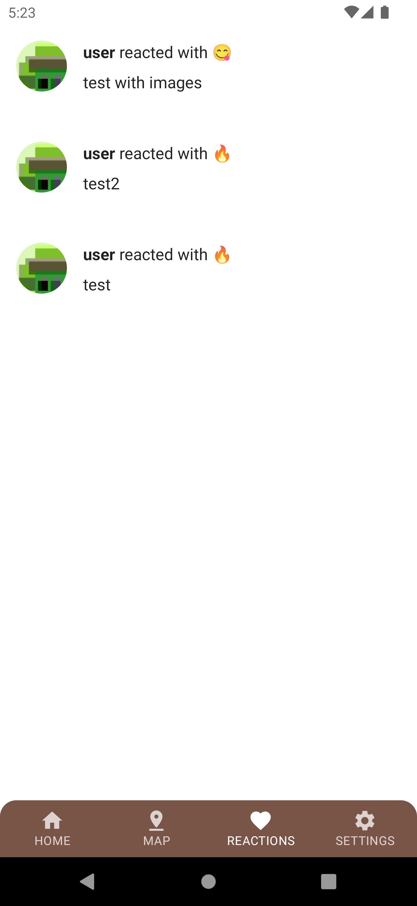
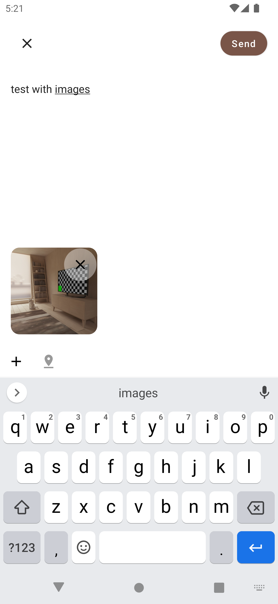

# FooS

FooS is an Android app I created during the first month of my internship at Mirrativ. This
social-network-based app allows users to tag posts with location data, which are then displayed as
speech bubbles on a map. The concept behind FooS is to make it easier to find restaurants and other
dining spots.

## Features

While some features are still in progress, FooS includes many standard social networking features:

-Post messages with images or location data
-Follow other users
-Browse posts on Google Maps by moving around the map (API key required)
-Add reactions to posts
-Set a custom profile picture
-View user profiles with tabs for posts, media, and reactions

Screenshots:






## Try It Out Yourself

Follow these steps to run FooS locally:

1. Install Firebase CLI tools
2. Obtain a Google Maps API key and configure it (optional)
3. Run the Firebase emulator
4. Build and install the app on an emulator device

### 1. Install Firebase CLI

Run the following command:

```shell
curl -sL https://firebase.tools | bash  
```

### 2. Google Maps API Key

To use Google Maps, add your API key in the following file:
[app/src/main/AndroidManifest.xml](app/src/main/AndroidManifest.xml)

### 3. Run the Firebase Emulator

Navigate to the Firebase configuration directory and start the emulator:

```shell
cd firebase_config
firebase emulators:start
```

### 4. Run the App on Android Emulator

To test FooS, install it on an emulator (not a real device). To run it on a real device, configure
Firebase hosts in [MainActivity](app/src/main/java/com/github/kitakkun/foos/MainActivity.kt) or set
up the real Firebase services.
